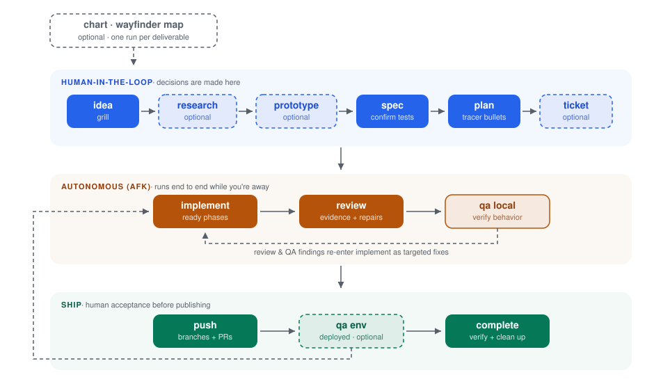
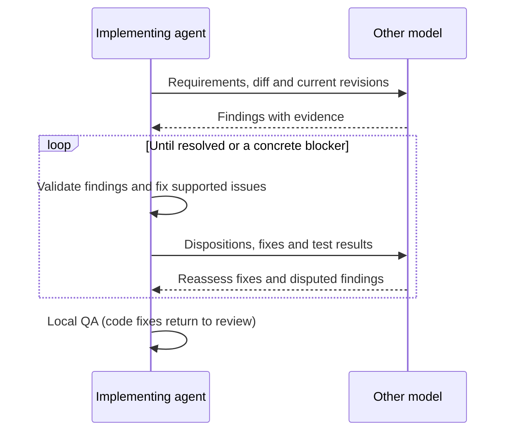

# flow

Describe the outcome. Shape the spec and plan together. Let agents implement, review, fix and test, then judge the result yourself.

A delivery skill for **Claude Code Desktop and CLI** and **Codex desktop and CLI**.

<picture>
  <source media="(prefers-color-scheme: dark)" srcset="assets/pipeline-dark.svg">
  
</picture>

## Start a feature

| You and the agent | Claude Code | Codex |
|-------------------|-------------|-------|
| Define the problem | `/flow idea add API rate limiting` | `$flow idea add API rate limiting` |
| Agree the requirements | `/flow spec rate-limiting` | `$flow spec rate-limiting` |
| Approve useful slices | `/flow plan rate-limiting` | `$flow plan rate-limiting` |
| Run the autonomous middle | `/flow implement rate-limiting` | `$flow implement rate-limiting` |

The first run configures the project. Once the spec and plan are approved, one `implement` invocation covers implementation, review, repairs and local QA. It returns a demonstration and verification evidence, or a concrete blocker.

You decide outcomes, public contracts and trade-offs. Agents choose implementation details within that agreement. Use `chart` for work too large for one spec, or simply say "grill me" to explore an idea.

## Two models, one review conversation

| Implementation lead | Default reviewer |
|---------------------|------------------|
| Codex | Claude |
| Claude | Codex |



Follow-ups reuse the reviewer session. A fresh session gets the saved review history when continuation is unavailable. Findings are checked against code and requirements; model agreement alone is not enough. An initial clean review goes straight to QA.

`review.reviewer: auto` selects the opposite family. Flow uses an available review bridge, then the other provider's authenticated CLI if needed. It never silently substitutes self-review. You can explicitly choose `current` to opt out, or name `claude`, `codex` or a review command. [Review transport details](reviewer-transport.md).

## Install and choose your host

Install the whole directory, including its supporting files:

```bash
# Codex desktop and CLI
git clone https://github.com/kentloog/flow.git ~/.agents/skills/flow

# Claude Code Desktop and CLI
git clone https://github.com/kentloog/flow.git ~/.claude/skills/flow
```

Project-local locations are `.agents/skills/flow` and `.claude/skills/flow`. Keep both copies on the same version. Restart sessions after updating a cached skill. Preserve local edits before updating an existing installation.

| Host | Skill entry | Reviewer access |
|------|-------------|-----------------|
| Claude Code in Desktop | `/flow` | Codex bridge or `codex` CLI |
| Claude Code CLI | `/flow` | Codex bridge or `codex` CLI |
| Codex desktop app | `$flow` | Claude bridge or `claude` CLI |
| Codex CLI | `$flow` | Claude bridge or `claude` CLI |

Use a coding session with repository and shell access. Here, Claude Desktop means its **Code** experience; ordinary chat alone does not supply the local workflow tools. Claude Code shares skill and MCP configuration between Desktop and CLI. [Claude documentation](https://code.claude.com/docs/en/desktop). Codex discovers personal and repository skills. [Codex documentation](https://learn.chatgpt.com/docs/build-skills).

Before leaving a run AFK, settle reviewer authentication, permissions, app startup and QA access. A UI feature needs browser tooling. The skill uses existing permissions and native model settings.

## Resume without carrying every detail

The coordinator keeps state and report pointers. Native workers use separate contexts when available; otherwise implementation runs sequentially. Full logs stay in files.

```text
.flow/
├── config.yml              Project settings
├── rate-limiting/
│   ├── state.yaml          Progress, reviewer session and next action
│   ├── spec.md / plan.md   Approved requirements and execution plan
│   ├── review-code.md      Findings, decisions and follow-ups
│   ├── qa-local.md         Behavior verified on recorded revisions
│   └── logs/               Worker reports and verification evidence
└── worktrees/              Isolated feature checkouts
```

Compaction continues from these files. After a crash, reopen the original project and run `implement` again. You can switch hosts where the same files are accessible; resume one coordinator at a time. A closed app cannot continue working, and old PASS results cannot certify changed code.

## Accept and ship

Try the demonstration and judge the experience. Then use `push` to publish branches and PRs. `complete` verifies merged work and preserves useful decisions before cleaning up temporary files. Publication remains separate unless already authorized.

<details>
<summary>All commands</summary>

Use the arguments below after `/flow` or `$flow`.

| Arguments | Purpose |
|-----------|---------|
| `setup` | Configure repositories, tracker, worktrees, QA and reviewer |
| `chart <description or map>` | Map decisions above individual specs |
| `idea <description>` | Define the problem and explore consequential decisions |
| `research <slug>` / `prototype <slug>` | Resolve factual or design uncertainties |
| `spec <slug>` | Agree requirements and acceptance interfaces |
| `plan <slug>` / `ticket <slug>` | Plan verifiable slices / optional tracker tickets |
| `implement <slug>` | Run or resume implementation, review, fixes and local QA |
| `review <slug>` | Review and repair existing work; pending phases stay pending |
| `qa <slug> [env]` | One local or configured environment QA pass |
| `replan <slug> [phase]` | Adjust remaining work |
| `push <slug>` / `complete <slug>` | Publish / verify merged and clean up |
| `status <slug>` / `list` | Show progress, blockers and the next action |

</details>

<details>
<summary>Configuration, design and validation</summary>

[Setup](setup-steps.md) defines `.flow/config.yml`. Existing `auto` configs now select the opposite family instead of falling back to self-review. [State](state-schema.md) defines recovery and evidence. [SKILL.md](SKILL.md) routes agents to the instructions they need.

[Design notes and sources](SIMPLIFICATION-NOTES.md) explain the choices. [Validation results](ABLATION-PLAN.md) distinguish completed checks from scenarios still to test. Portability is a shared instruction contract; it is not a claim that every desktop permission setup has been tested.

</details>

## Credits

Inspired by Matt Pocock's [wayfinder](https://github.com/mattpocock/skills/tree/main/skills/engineering/wayfinder), [grilling](https://github.com/mattpocock/skills/blob/main/skills/productivity/grilling/SKILL.md), [to-spec](https://github.com/mattpocock/skills/blob/main/skills/engineering/to-spec/SKILL.md) and [implement-spec](https://github.com/mattpocock/skills/blob/main/skills/in-progress/implement-spec/SKILL.md).

[MIT license](LICENSE)
